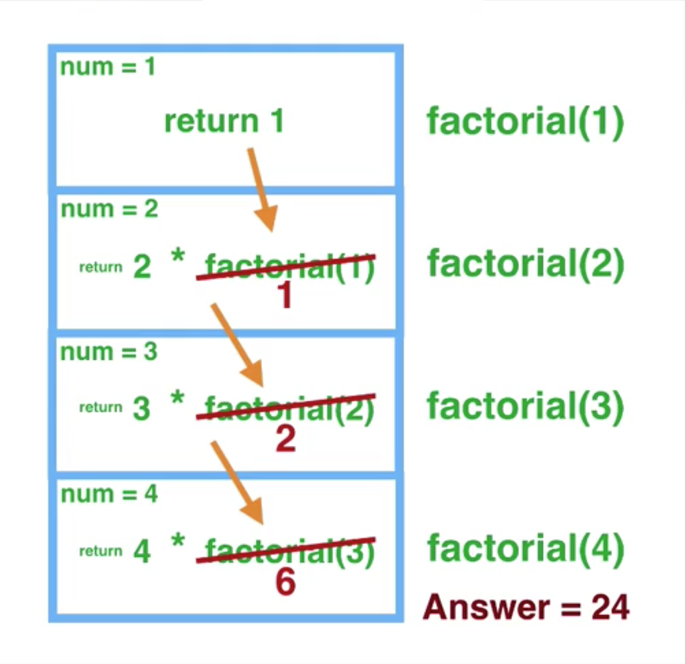

# Recursion
When a function calls itself until a base case is satisfied.

An example of a recursive function:

```js
function factorial(number) {
    /**
    * Not 1 because anything multiplied by itself doesn't change.
    * Removes 1 extra function call.
    */
    if (number === 2) { // base case
        return number
    }
    else { // recursive case
        return number * factorial(number - 1)
    }
}
```

To understand what's going on, you need to look at the call stack i.e. go
through what happens step by step.

We keep building up the call stack using the recursive case `number * factorial(number - 1)`
until the base case is satisfied. Once that base case is satisfied, the call-stack will reverse; returning
to the previous function call that called it.



Once the function chain reaches `2 * factorial(2 - 1)` and returns `1` as a result of the base case, it will
then proceed to process the results of `3 * factorial(3 - 1)` and so on until it reaches the `number` that was
provided in the first call to `factorial(number)`.

## Notes
Recursive functions can be useful to reduce code. But they can also be really hard to get your head around. If there
is an iterative solution that has similar or equal performance, you should go with the iterative approach.
