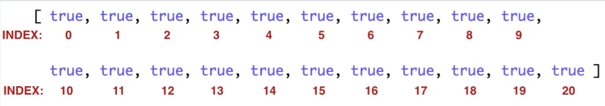

# Sieve of Eratosthenes

## Purpose
Good solution design. This is a really effective way to find prime numbers. Learning the technique of "marking" and
using index as `n`, will be transferable.



### Recursion
For a function to be recursive, it must call itself within the body somewhere.

There is always a base case to exit the recursion and a recursive case to continue it.

```js
const check = true
function func() {
    if (check) { // base case
        return 2;
    } else { // recursive case
        func()
    }
}
```

## Exercise Details
Find all the prime numbers up to a given number.

`sieveOfEratosthenes(20)` should return `[2, 3, 5, 7, 11, 13, 17, 19]`.

```js
function sieveOfEratosthenes(number) {}
```
