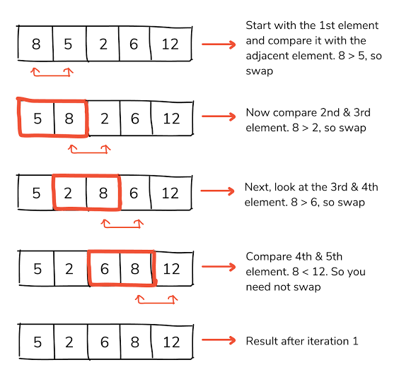

# Bubble Sort

## Purpose
Understanding time complexity.

This algorithm has a time complexity of `O (n - 1)`

## Exercise Details
Return an array sorted using the bubble sorting technique.



```js
function bubbleSort(array) {}
```
