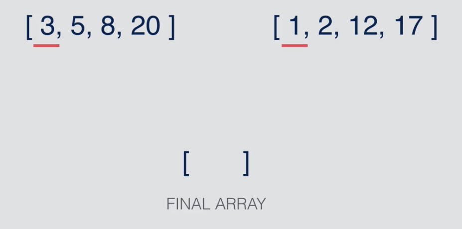
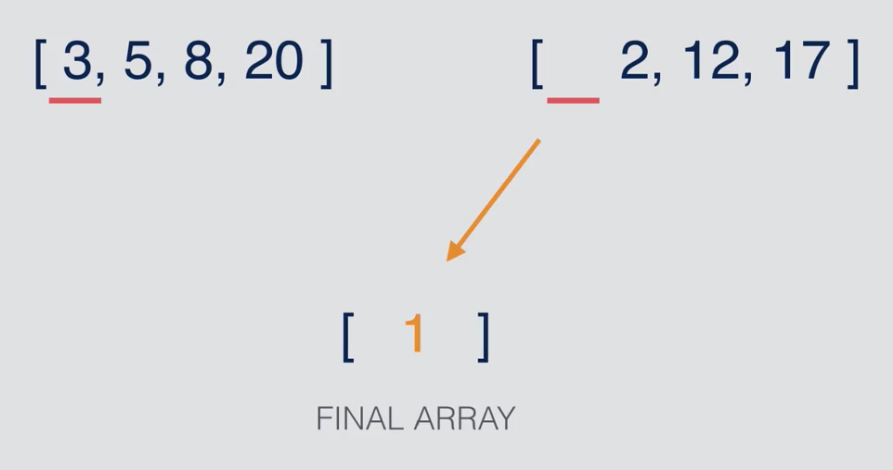
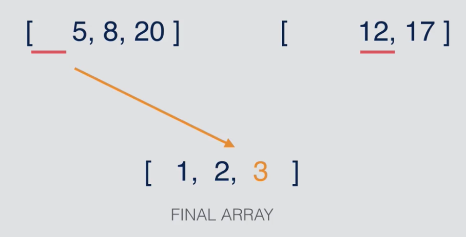
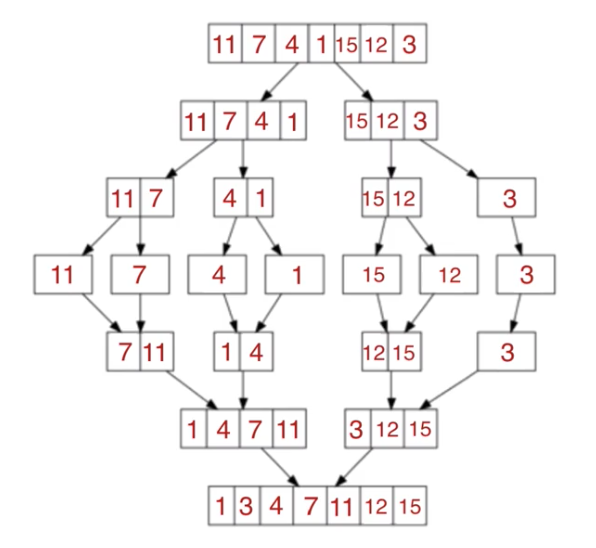
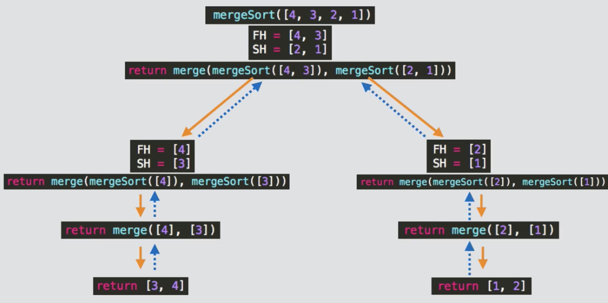
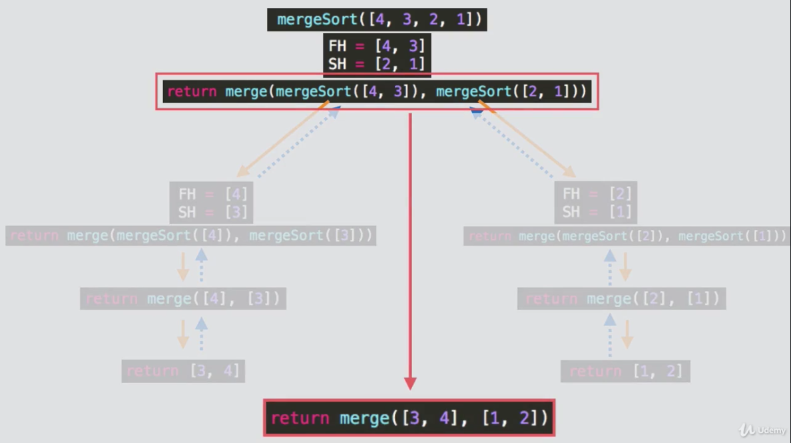
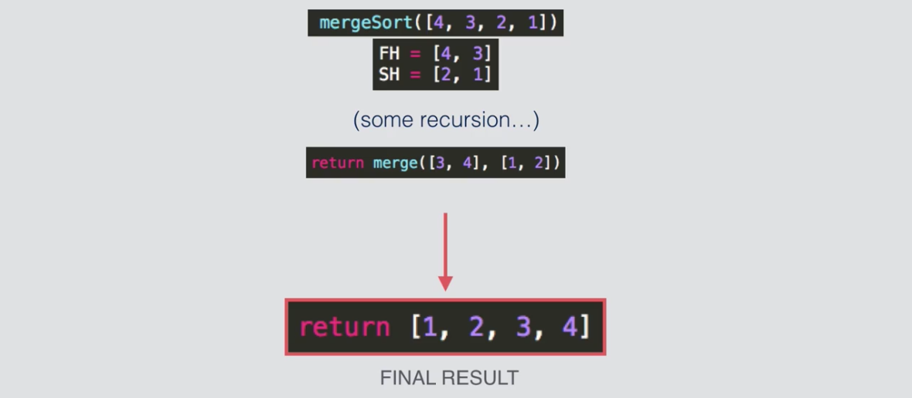

# Merge Sort

## Purpose
Understanding time complexity.

## Exercise Details
Return an array sorted using the merge sorting technique.






```js
/**
* Takes in a single, unsorted array as a parameter.
* Splits the array into two halves.
*/
function mergeSort(array) {}


/**
* Takes in two sorted arrays as parameters.
* Merges the two sorted arrays into one sorted array.
* Returns one sorted array
*/
function merge(array1, array2) {}
```

### Recursion behavior step by step
Once the function call hits the base case of `mergeSort(array with 1 item)`, the recursive
functions will start to unwind.




